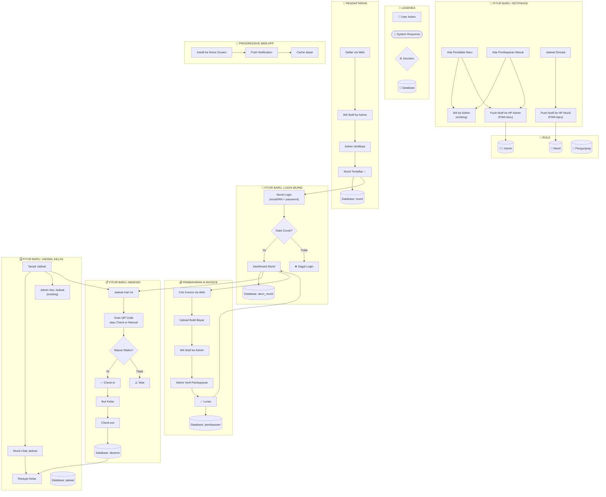

# Tahap 11 — Workflow Fitur Baru Magic Pencil

## Alur Kerja:

### 1️⃣ Pendaftaran (Existing)
- User daftar → WA notif admin → Admin verif → Murid terdaftar ✅

### 2️⃣ Pembayaran & Invoice (Existing)
- Murid cek invoice → Upload bukti → WA notif admin → Admin verif ✅

### 3️⃣ 🔥 Baru: Login Murid
- Setelah terdaftar, murid bisa bikin akun login
- Dashboard pribadi: liat jadwal, absensi, tagihan

### 4️⃣ 🔥 Baru: Absensi Check-in/out
- Murid buka dashboard → Cek jadwal hari ini → Check-in (QR/manual)
- Ikut kelas → Check-out → Tersimpan otomatis

### 5️⃣ 🔥 Baru: Jadwal Kelas
- Admin atur jadwal (existing) + Murid lihat jadwal pribadi
- Riwayat kelas yang sudah diikuti

### 6️⃣ 🔥 Baru: Notifikasi Push (PWA)
- Pendaftar baru + Pembayaran masuk → Push ke HP admin
- Jadwal mulai → Push ke HP murid

---

**Gimana willy?** Ada yang mau ditambah/dikurang dari skema ini? Kalo udah oke, mamat mulai bikin backendnya! 🚀😊
