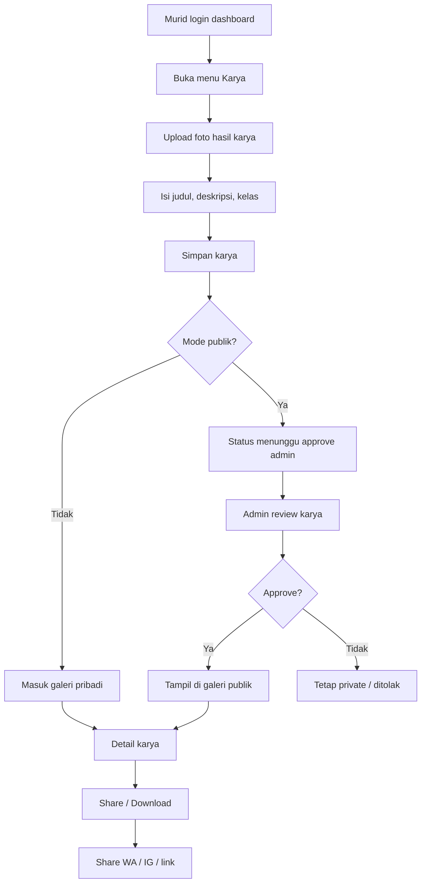

# Tahap 16 - Galeri Karya Murid + Share Sosmed

## Alur singkat
1. Murid upload foto hasil karya dari dashboard.
2. Sistem simpan metadata karya, status default private.
3. Jika murid pilih publik, karya masuk antrian review admin.
4. Admin bisa approve atau menolak.
5. Karya yang lolos tampil di galeri publik.
6. Murid bisa buka detail, download, atau share.

## Aturan
- Default: private.
- Publik hanya setelah approve.
- Watermark kecil Magic Pencil opsional.
- Share ke sosmed cukup dari link / download / share card.
